# Backend Node 2025 - Talento Tech Final Project

Este proyecto es una API RESTful construida con **Node.js** y **Express**, utilizando **Firebase Firestore** como base de datos y **JWT** para autenticación.

## 🏗 Arquitectura

El proyecto sigue una arquitectura en capas para asegurar la escalabilidad y mantenibilidad.

### Diagrama de Flujo de Datos


### Estructura de Capas

```mermaid
classDiagram
    class Route {
        +Define Endpoints
        +Asigna Controladores
    }
    class Middleware {
        +Valida Tokens JWT
        +Maneja Errores
    }
    class Controller {
        +Recibe Request
        +Valida Input
        +Llama Servicio
        +Envía Response
    }
    class Service {
        +Lógica de Negocio
        +Procesa Datos
    }
    class Model {
        +Interacción con BD
        +Operaciones CRUD
    }
    
    Route --> Middleware
    Route --> Controller
    Controller --> Service
    Service --> Model
```



### Relación entre Servicios


> **Nota**: Los servicios son independientes y no se comunican entre sí.

---

## 🚀 Instalación y Configuración

### Prerrequisitos
- Node.js (v18+)
- Cuenta de Firebase

### Pasos
1.  **Clonar el repositorio**
2.  **Instalar dependencias**
    ```bash
    npm install
    ```
3.  **Configurar Variables de Entorno**
    Crea un archivo `.env` en la raíz del proyecto basándote en `.env.example` (si existe) o con la siguiente estructura:
    ```env
    PORT=3000
    NODE_ENV=development
    
    # Firebase Credenciales
    FIREBASE_API_KEY=tu_api_key
    FIREBASE_AUTH_DOMAIN=tu_proyecto.firebaseapp.com
    FIREBASE_PROJECT_ID=tu_proyecto
    FIREBASE_STORAGE_BUCKET=tu_proyecto.appspot.com
    FIREBASE_MESSAGING_SENDER_ID=tu_sender_id
    FIREBASE_APP_ID=tu_app_id
    
    # Seguridad
    JWT_SECRET=tu_secreto_super_seguro
    ```
4.  **Iniciar el servidor**
    ```bash
    npm start
    ```

---

## 🧪 Cómo probar con Postman

### 1. Obtener Token (Login)
*   **Método**: `POST`
*   **URL**: `http://localhost:3000/auth/login`
*   **Body** (JSON):
    ```json
    {
      "email": "user@example.com",
      "password": "password"
    }
    ```
*   **Respuesta**: Recibirás un JSON con el token.
    ```json
    {
      "token": "Bearer <TU_TOKEN_JWT>"
    }
    ```

### 2. Configurar Autenticación en Postman
Para no copiar y pegar el token en cada request, puedes usar la pestaña **Authorization** en Postman:
1.  Ve a la pestaña **Authorization** de tu request (o de la colección).
2.  Tipo: **Bearer Token**.
3.  Token: Pega el token que obtuviste en el paso anterior (sin la palabra "Bearer " si Postman ya la agrega, usualmente solo el código alfanumérico).

### 3. Crear Producto (Ruta Protegida)
*   **Método**: `POST`
*   **URL**: `http://localhost:3000/products`
*   **Body** (JSON):
    ```json
    {
      "name": "Nuevo Producto",
      "price": 1500,
      "description": "Descripción del producto"
    }
    ```
*   **Nota**: Si no envías el token, recibirás un error `401 Unauthorized`.

### 4. Eliminar Producto (Ruta Protegida)
*   **Método**: `DELETE`
*   **URL**: `http://localhost:3000/products/<ID_DEL_PRODUCTO>`
*   **Nota**: Requiere autenticación.

### 5. Ver Productos (Ruta Pública)
*   **Método**: `GET`
*   **URL**: `http://localhost:3000/products`
*   **Nota**: No requiere token.
